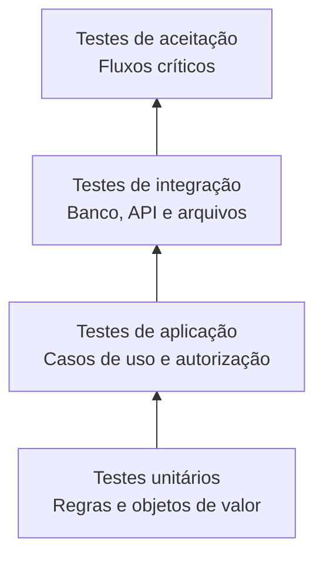

### 10.3 Pirâmide de testes

```mermaid
flowchart BT
    U[Testes unitários\nRegras e objetos de valor] --> A[Testes de aplicação\nCasos de uso e autorização]
    A --> I[Testes de integração\nBanco, API e arquivos]
    I --> C[Testes de aceitação\nFluxos críticos]
```