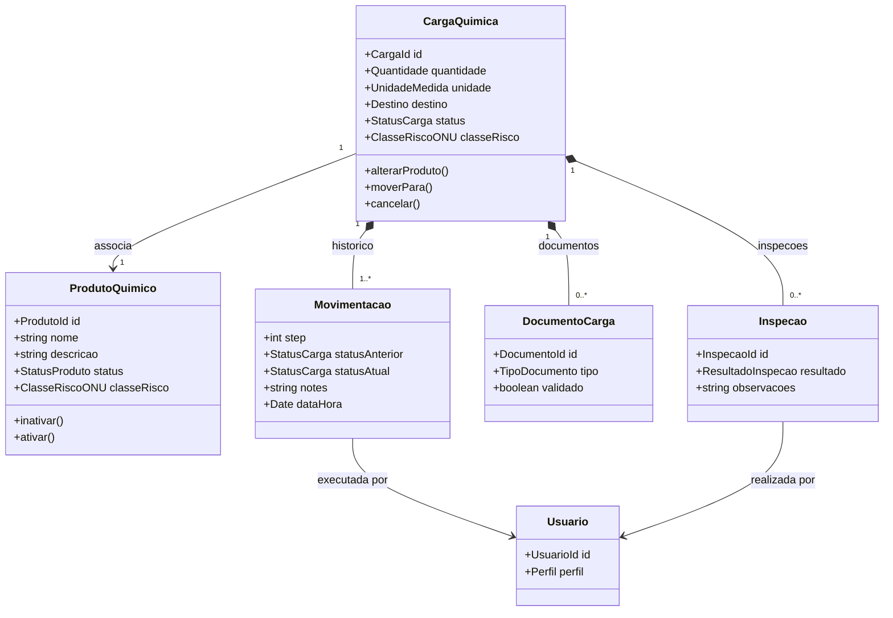

### 4.5 Diagrama de domínio

```mermaid
classDiagram
    class ProdutoQuimico {
        +ProdutoId id
        +string nome
        +string descricao
        +StatusProduto status
        +ClasseRiscoONU classeRisco
        +inativar()
        +ativar()
    }

    class CargaQuimica {
        +CargaId id
        +Quantidade quantidade
        +UnidadeMedida unidade
        +Destino destino
        +StatusCarga status
        +ClasseRiscoONU classeRisco
        +alterarProduto()
        +moverPara()
        +cancelar()
    }

    class Movimentacao {
        +int step
        +StatusCarga statusAnterior
        +StatusCarga statusAtual
        +string notes
        +Date dataHora
    }

    class DocumentoCarga {
        +DocumentoId id
        +TipoDocumento tipo
        +boolean validado
    }

    class Inspecao {
        +InspecaoId id
        +ResultadoInspecao resultado
        +string observacoes
    }

    class Usuario {
        +UsuarioId id
        +Perfil perfil
    }

    CargaQuimica "1" --> "1" ProdutoQuimico : associa
    CargaQuimica "1" *-- "1..*" Movimentacao : historico
    CargaQuimica "1" *-- "0..*" DocumentoCarga : documentos
    CargaQuimica "1" *-- "0..*" Inspecao : inspecoes
    Movimentacao --> Usuario : executada por
    Inspecao --> Usuario : realizada por
```