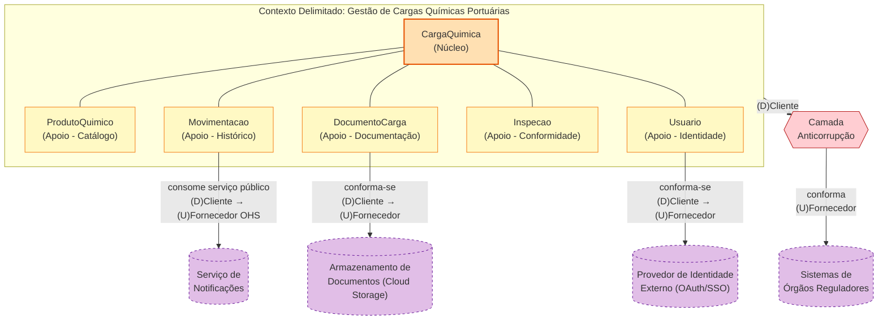

### 4.7 Mapa de Contexto

```mermaid
flowchart TB
    subgraph QP["Contexto Delimitado: Gestão de Cargas Químicas Portuárias"]
        direction TB
        CQ["CargaQuimica<br/>(Núcleo)"]
        PQ["ProdutoQuimico<br/>(Apoio - Catálogo)"]
        MV["Movimentacao<br/>(Apoio - Histórico)"]
        DC["DocumentoCarga<br/>(Apoio - Documentação)"]
        IN["Inspecao<br/>(Apoio - Conformidade)"]
        US["Usuario<br/>(Apoio - Identidade)"]
        CQ --- PQ
        CQ --- MV
        CQ --- DC
        CQ --- IN
        CQ --- US
    end

    ID[("Provedor de Identidade<br/>Externo (OAuth/SSO)")]
    ST[("Armazenamento de<br/>Documentos (Cloud Storage)")]
    RG[("Sistemas de<br/>Órgãos Reguladores")]
    NT[("Serviço de<br/>Notificações")]
    ACL{{"Camada<br/>Anticorrupção"}}

    US -- "conforma-se<br/>(D)Cliente → (U)Fornecedor" --> ID
    DC -- "conforma-se<br/>(D)Cliente → (U)Fornecedor" --> ST
    QP -- "(D)Cliente" --> ACL
    ACL -- "conforma<br/>(U)Fornecedor" --> RG
    MV -- "consome serviço público<br/>(D)Cliente → (U)Fornecedor OHS" --> NT

    classDef core fill:#FFE0B2,stroke:#E65100,stroke-width:2px
    classDef support fill:#FFF9C4,stroke:#F57F17,stroke-width:1px
    classDef external fill:#E1BEE7,stroke:#6A1B9A,stroke-width:1px,stroke-dasharray: 4 4
    classDef acl fill:#FFCDD2,stroke:#B71C1C,stroke-width:1px

    class CQ core
    class PQ,MV,DC,IN,US support
    class ID,ST,RG,NT external
    class ACL acl
```