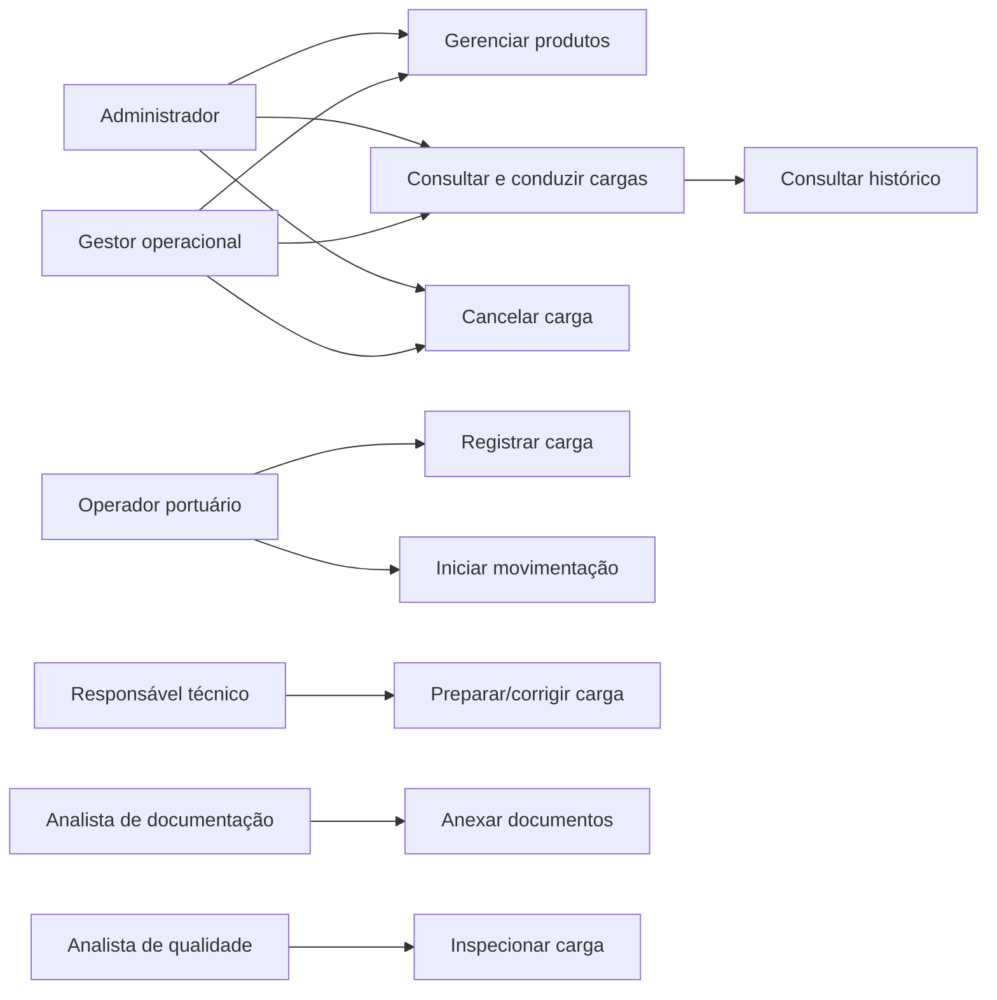

### 6.1 Diagrama de casos de uso

```mermaid
flowchart LR
    Admin[Administrador] --> Produtos[Gerenciar produtos]
    Admin --> Cargas[Consultar e conduzir cargas]
    Admin --> Cancelar[Cancelar carga]
    Gestor[Gestor operacional] --> Produtos
    Gestor --> Cargas
    Gestor --> Cancelar
    Operador[Operador portuário] --> Registrar[Registrar carga]
    Operador --> Transporte[Iniciar movimentação]
    Tecnico[Responsável técnico] --> Preparar[Preparar/corrigir carga]
    Documentacao[Analista de documentação] --> Anexar[Anexar documentos]
    Qualidade[Analista de qualidade] --> Inspecionar[Inspecionar carga]
    Cargas --> Historico[Consultar histórico]
```