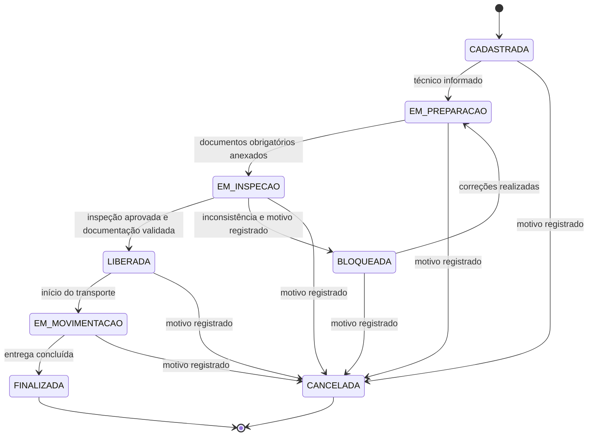

### 7.1 Diagrama de transição

```mermaid
stateDiagram-v2
    [*] --> CADASTRADA
    CADASTRADA --> EM_PREPARACAO: técnico informado
    EM_PREPARACAO --> EM_INSPECAO: documentos obrigatórios anexados
    EM_INSPECAO --> LIBERADA: inspeção aprovada e documentação validada
    EM_INSPECAO --> BLOQUEADA: inconsistência e motivo registrado
    BLOQUEADA --> EM_PREPARACAO: correções realizadas
    LIBERADA --> EM_MOVIMENTACAO: início do transporte
    EM_MOVIMENTACAO --> FINALIZADA: entrega concluída
    CADASTRADA --> CANCELADA: motivo registrado
    EM_PREPARACAO --> CANCELADA: motivo registrado
    EM_INSPECAO --> CANCELADA: motivo registrado
    BLOQUEADA --> CANCELADA: motivo registrado
    LIBERADA --> CANCELADA: motivo registrado
    EM_MOVIMENTACAO --> CANCELADA: motivo registrado
    FINALIZADA --> [*]
    CANCELADA --> [*]
```
