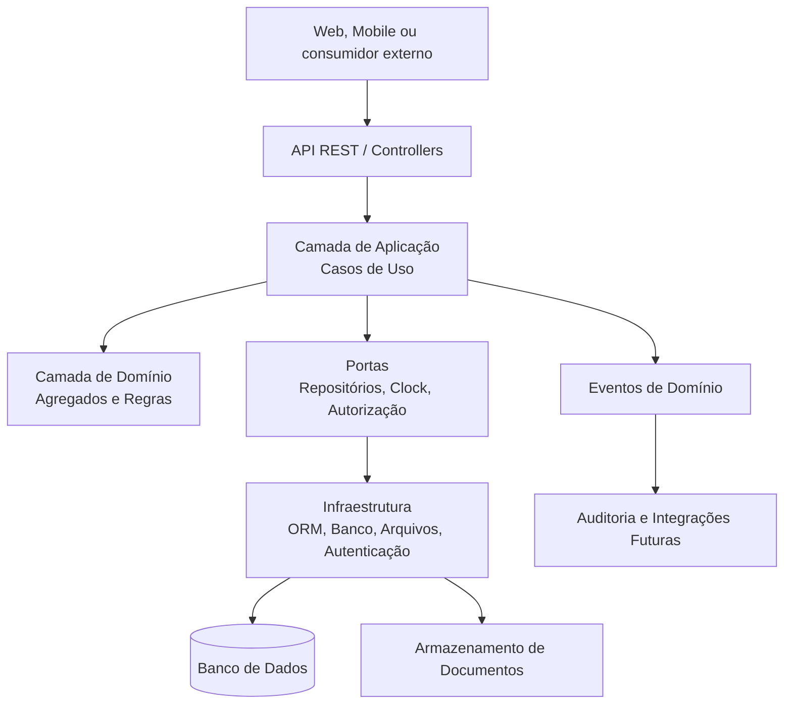

### 8.3 Diagrama de arquitetura

```mermaid
flowchart TB
    Cliente[Web, Mobile ou consumidor externo] --> API[API REST / Controllers]
    API --> Aplicacao[Camada de Aplicação\nCasos de Uso]
    Aplicacao --> Dominio[Camada de Domínio\nAgregados e Regras]
    Aplicacao --> Portas[Portas\nRepositórios, Clock, Autorização]
    Portas --> Infra[Infraestrutura\nORM, Banco, Arquivos, Autenticação]
    Infra --> Banco[(Banco de Dados)]
    Infra --> Arquivos[Armazenamento de Documentos]
    Aplicacao --> Eventos[Eventos de Domínio]
    Eventos --> Auditoria[Auditoria e Integrações Futuras]
```