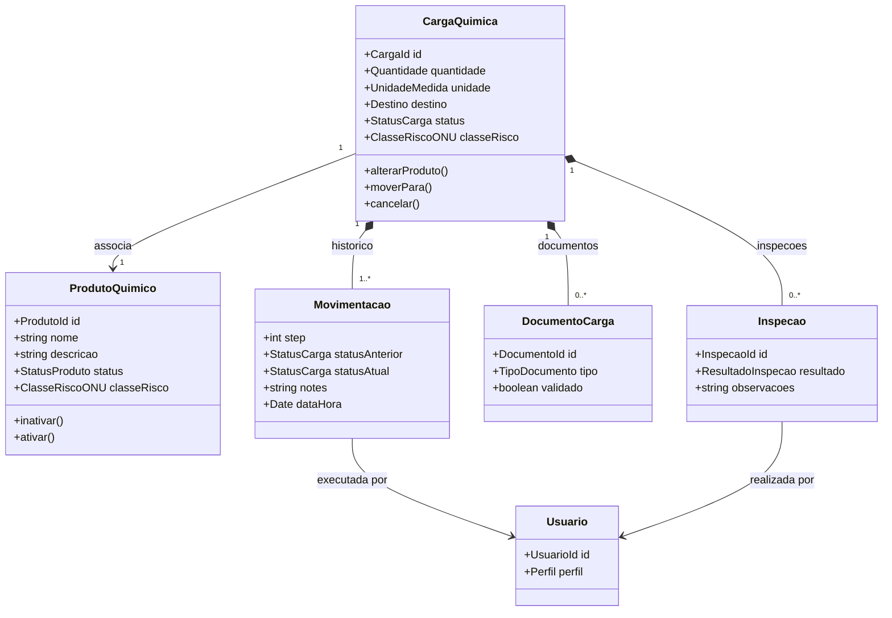
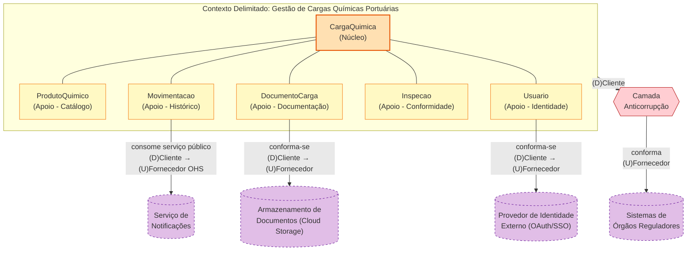
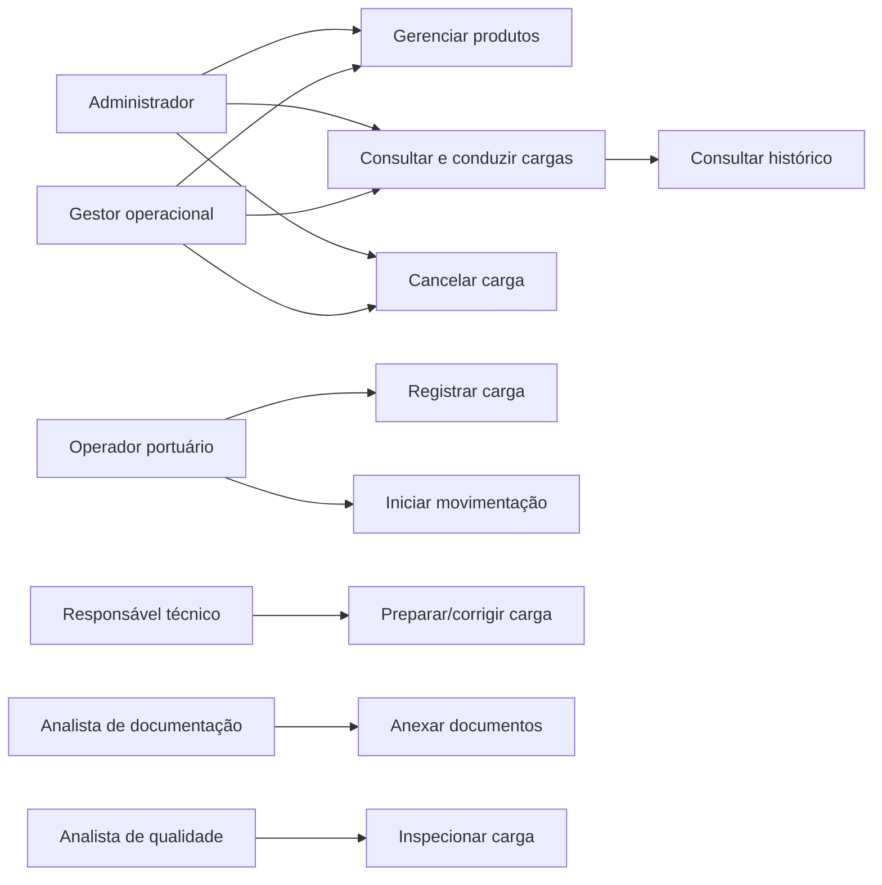
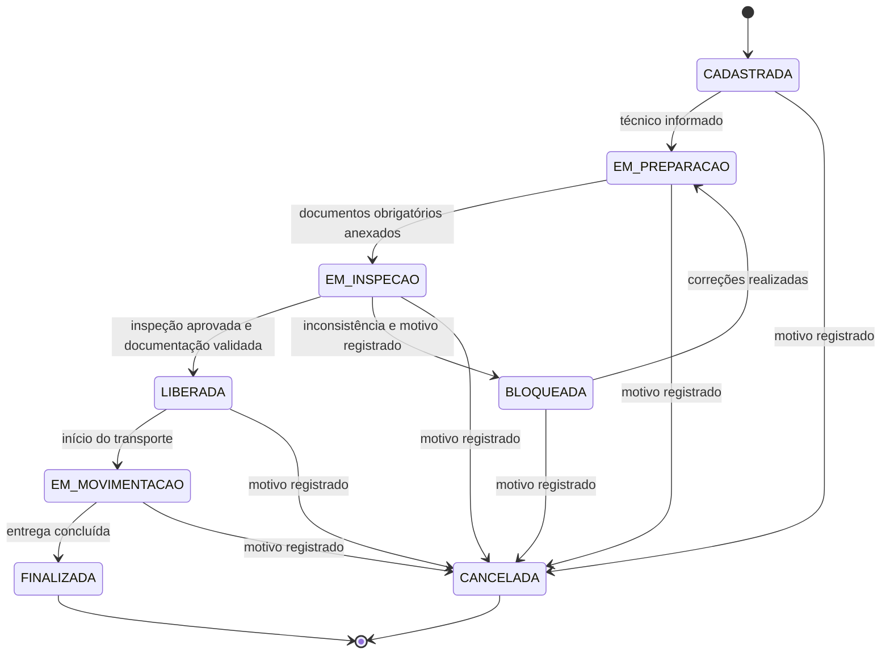
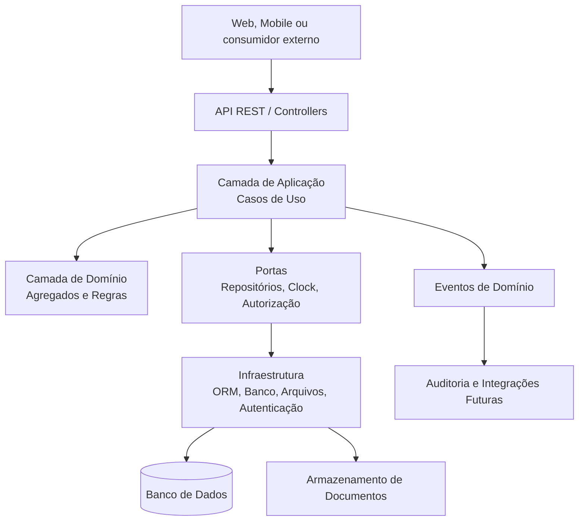
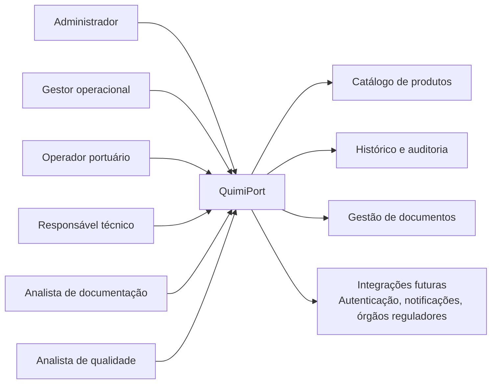
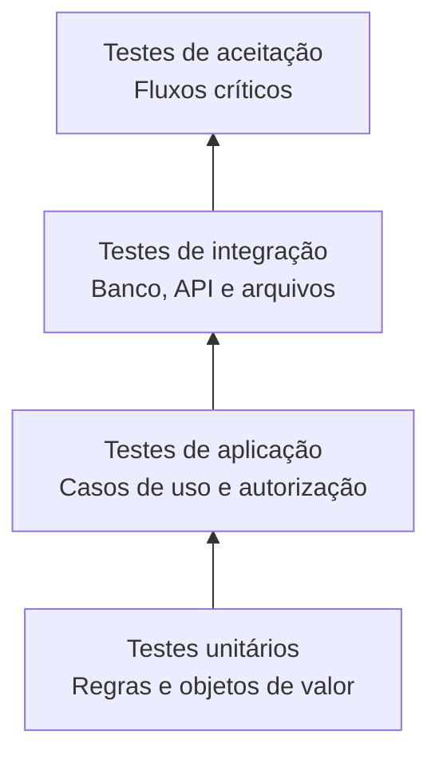

# QuimiPort

## Documentação Técnica e Arquitetural

**Instituição:** FIAP POSTECH  
**Curso/Disciplina:** Full Stack Development    
**Turma:** 10FSDT   
**Integrantes:**    
Bruno de Almeida Dias - brunoadias1996@gmail.com    
Adriel de Sousa Ribeiro - adrielsousaribeiro69@gmail.com    
Nasser Ferreira Tarraf - nasserferreirat@gmail.com  
Glauton Feitosa da Silva - glauton.silva@outlook.com         
**Data:** 01/09/2026    
**Professor:**  Israel Meinert

---

## Video da Apresentação da Doc QuimiPort

[▶️ Video de Apresentação da Proposta Tcnica](https://youtu.be/Wdpwq6Uye4E)

---

## Sumário

1. [Introdução](#1-introdução)
2. [Entendimento do Domínio](#2-entendimento-do-domínio)
3. [Linguagem Ubíqua](#3-linguagem-ubíqua)
4. [Modelagem de Domínio com DDD](#4-modelagem-de-domínio-com-ddd)
5. [Regras de Negócio e Invariantes](#5-regras-de-negócio-e-invariantes)
6. [Casos de Uso](#6-casos-de-uso)
7. [Fluxo de Status da Carga](#7-fluxo-de-status-da-carga)
8. [Arquitetura Proposta](#8-arquitetura-proposta)
9. [Organização do Projeto](#9-organização-do-projeto)
10. [Planejamento de Qualidade de Software](#10-planejamento-de-qualidade-de-software)
11. [Aplicação de JavaScript Avançado e TypeScript](#11-aplicação-de-javascript-avançado-e-typescript)
12. [Decisões Arquiteturais e Evolução](#12-decisões-arquiteturais-e-evolução)
13. [Premissas e Pontos em Aberto](#13-premissas-e-pontos-em-aberto)
14. [Referências Documentais](#14-referências-documentais)

---

## 1. Introdução

O QuimiPort é uma proposta de sistema para gestão de cargas químicas em ambiente portuário. O problema tratado é o controle descentralizado e manual de informações relevantes para a segurança e a operação logística: produto químico, classificação de risco, documentação, responsável técnico, inspeção, movimentação e histórico.

Uma carga química não é apenas um registro de transporte. Ela possui um ciclo de vida sujeito a restrições de segurança. Uma carga sem documentação validada não pode ser liberada; uma carga bloqueada não pode iniciar movimentação; uma carga finalizada ou cancelada não pode sofrer novas movimentações. O sistema deve impedir esses estados inválidos antes que sejam persistidos.

Esta documentação estabelece a base técnica para evolução do produto. Ela descreve o domínio, a modelagem orientada a domínio, os casos de uso, as regras operacionais, a arquitetura inicial e o planejamento de qualidade. A proposta não pressupõe uma aplicação funcional nesta fase.

### 1.1 Objetivo geral

Planejar uma solução full stack evolutiva para registrar, controlar e acompanhar cargas químicas portuárias, preservando rastreabilidade, regras de segurança e responsabilidade por cada ação relevante.

### 1.2 Objetivos específicos

- Cadastrar produtos químicos com classe de risco válida e controlar sua disponibilidade para novas cargas.
- Registrar cargas somente com os dados mínimos necessários para sua identificação operacional.
- Controlar transições de status por uma máquina de estados explícita.
- Registrar o histórico cronológico de cada movimentação da carga.
- Restringir ações conforme o perfil e a etapa operacional da carga.
- Definir uma estratégia de testes que preserve as regras críticas em futuras implementações.

### 1.3 Escopo da primeira fase

O escopo inclui o núcleo de domínio do QuimiPort: produtos químicos, cargas químicas, movimentações, responsáveis, documentação, inspeção, permissões e auditoria. Persistência, autenticação, interface web e integrações são tratados como fronteiras arquiteturais planejadas, sem implementação obrigatória.

## 2. Entendimento do Domínio

### 2.1 Problema de negócio

Em operações portuárias, o transporte e a armazenagem de substâncias químicas exigem controle de risco, responsabilidade técnica e documentação. Registros manuais ou dispersos dificultam a confirmação de que uma carga está apta a seguir para a próxima etapa. Isso cria risco de movimentação indevida, perda de rastreabilidade e falhas de auditoria.

O QuimiPort centraliza esse processo em um fluxo controlado. O sistema registra o produto associado, a classificação de risco herdada, os documentos exigidos, os participantes responsáveis e as decisões de inspeção. A liberação operacional resulta de condições verificáveis, não de alteração manual isolada de status.

### 2.2 Usuários e responsabilidades

| Perfil | Responsabilidade no domínio |
|---|---|
| Administrador do sistema | Administra produtos, possui acesso a todas as etapas da carga e pode cancelar cargas. |
| Gestor operacional | Acompanha e conduz todas as etapas da carga; pode cancelar cargas. |
| Operador portuário | Atua durante as etapas `LIBERADA` e `EM_MOVIMENTACAO`. |
| Responsável técnico | Atua em `EM_PREPARACAO` e `BLOQUEADA`, preparando ou corrigindo a carga. |
| Analista de documentação | Anexa e organiza documentos obrigatórios durante `EM_PREPARACAO`. |
| Analista de qualidade | Realiza a inspeção durante `EM_INSPECAO`. |
| Inspetor responsável | Pessoa designada para validar documentação e informações durante a inspeção. |

### 2.3 Informações controladas

| Elemento | Informações principais | Finalidade |
|---|---|---|
| Produto químico | Nome, descrição, status e classe de risco ONU. | Identificar a substância e seu risco aplicável. |
| Carga química | Produto, quantidade, unidade, destino, descrição, previsões, status e auditoria. | Representar a unidade operacional acompanhada no porto. |
| Movimentação | Ordem, status anterior, status atual, observações, data/hora e usuário. | Formar o histórico imutável de mudanças de status. |
| Documento da carga | Tipo, anexo, situação de validação e responsável. | Demonstrar atendimento aos requisitos documentais. |
| Inspeção | Resultado, inspetor, data/hora e observações. | Registrar a decisão que libera ou bloqueia a carga. |
| Responsável técnico | Identificação do profissional designado. | Atribuir responsabilidade pela preparação técnica. |

### 2.4 Processo operacional

O processo inicia com o cadastro de uma carga associada a um produto ativo. A carga nasce em `CADASTRADA`. Ao ser preparada, recebe responsável técnico e documentos. A inspeção analisa a documentação, os dados da carga e os dados do produto. Uma aprovação libera a carga; uma inconsistência a bloqueia com motivo registrado. Cargas liberadas seguem para movimentação e depois finalização. O cancelamento é uma saída excepcional permitida antes da finalização.

### 2.5 Decisões tomadas pelo sistema

- Recusar produto sem nome, com nome duplicado ou classe de risco inválida.
- Recusar carga sem produto, quantidade positiva, unidade de medida ou destino.
- Recusar nova carga associada a produto inativo.
- Impedir alterações de produto depois que a carga deixa `CADASTRADA`.
- Validar se a transição de status pertence ao fluxo permitido.
- Exigir responsável técnico, documentação ou justificativa quando a etapa requer esses elementos.
- Negar ações a perfis sem autorização.
- Impedir movimentações depois de `FINALIZADA` ou `CANCELADA`.

## 3. Linguagem Ubíqua

Os termos seguintes devem ser usados de forma consistente entre especialistas do negócio, documentação, código, testes e interface.

| Termo | Definição operacional |
|---|---|
| Produto químico | Substância catalogada, identificada por nome único, classe ONU e status de atividade. |
| Carga química | Unidade de transporte ou operação logística vinculada a um produto químico e submetida a um ciclo de vida. |
| Classe de risco | Classificação ONU do produto químico, de 1 a 9, herdada pela carga associada. |
| Carga cadastrada | Estado inicial de uma carga recém-criada. |
| Preparação | Etapa de designação técnica e organização documental anterior à inspeção. |
| Inspeção | Etapa de validação das informações da carga, produto e documentação. |
| Liberação | Decisão de que a carga está apta para transporte. |
| Bloqueio | Estado de espera por correção após inconsistência identificada. |
| Movimentação | Evento que registra uma alteração de status da carga. |
| Step | Número sequencial cronológico de uma movimentação dentro de uma carga. |
| Histórico | Conjunto ordenado de movimentações de uma carga. |
| Documento obrigatório | Documento requerido para que a carga avance no fluxo e possa ser liberada. |
| Responsável técnico | Profissional associado à preparação técnica da carga. |
| Inspetor | Profissional que valida a carga durante a inspeção. |
| Cancelamento | Encerramento excepcional de uma carga ainda não finalizada, sempre com motivo. |

## 4. Modelagem de Domínio com DDD

### 4.1 Delimitação do contexto

O contexto delimitado nesta fase é **Gestão de Cargas Químicas Portuárias**. Dentro dele, o subdomínio central é o controle de ciclo de vida da carga química. Catálogo de produtos, identidade de usuários e gestão de documentos são subdomínios de apoio ao fluxo principal.

### 4.2 Agregado principal: Carga Química

`CargaQuimica` é o agregado principal porque concentra as decisões que precisam ser consistentes na mesma transação lógica: status atual, produto associado, classificação herdada, documentação, responsáveis, inspeção e histórico de movimentações.

O agregado protege os seguintes invariantes:

- Toda carga possui produto, quantidade positiva, unidade de medida e destino.
- Uma carga nova só pode referenciar produto ativo.
- A classificação de risco da carga corresponde à classe do produto associado.
- O produto associado só muda enquanto o status é `CADASTRADA`.
- Toda transição válida gera exatamente uma movimentação ordenada.
- Estados terminais impedem novas movimentações.
- Liberação depende de documentação validada.

### 4.3 Entidades

| Entidade | Identidade | Responsabilidade | Atributos relevantes | Regras relacionadas | Relacionamentos |
|---|---|---|---|---|---|
| ProdutoQuimico | `produtoId` | Manter catálogo e disponibilidade de produtos para novas cargas. | nome, descrição, status, classeRisco, auditoria. | PQ-01 a PQ-05 | Ciclo de vida independente; referenciado por `CargaQuimica` por identidade (não pertence ao agregado). |
| CargaQuimica | `cargaId` | Proteger o fluxo e as regras de segurança da carga. | produto, quantidade, unidade, destino, status, responsáveis, documentos, auditoria. | CQ-01 a CQ-08 | Agregado raiz; associa `ProdutoQuimico`; contém `Movimentacao`, `DocumentoCarga` e `Inspecao`. |
| Movimentacao | `movimentacaoId` ou identidade composta por carga e step | Registrar mudança de status de forma cronológica. | step, statusAnterior, statusAtual, notes, dataHora, usuario. | MV-01 a MV-11 | Pertence ao agregado `CargaQuimica`; referencia `Usuario` como executor. |
| DocumentoCarga | `documentoId` | Representar documento anexado e seu estado de validação. | tipo, referência do anexo, validado, responsável, dataHora. | MV-05, MV-07 | Pertence ao agregado `CargaQuimica`; validado antes da liberação. |
| Inspecao | `inspecaoId` | Registrar decisão de inspeção sobre a carga. | inspetor, resultado, observações, dataHora. | MV-06, MV-07 | Pertence ao agregado `CargaQuimica`; referencia `Usuario` como inspetor. |
| Usuario | `usuarioId` | Representar o agente que executa ação e possui perfil. | nome, perfil, situação. | PM-01 a PM-07 | Referenciado por `Movimentacao` e `Inspecao` como executor/autor; não integra o agregado da carga. |

### 4.4 Objetos de valor

| Objeto de valor | Composição | Regra encapsulada |
|---|---|---|
| ClasseRiscoONU | código entre 1 e 9 | Rejeita classes inexistentes. |
| Quantidade | valor decimal positivo | Rejeita zero e valores negativos. |
| UnidadeMedida | código ou descrição padronizada | Garante que a quantidade seja interpretável. |
| Destino | identificação textual ou estruturada | Impede carga sem destino. |
| StatusCarga | valor enumerado | Restringe estados a valores do fluxo. |
| Auditoria | criadoEm, criadoPor, alteradoEm, alteradoPor | Preserva autoria e tempo das alterações. |
| Motivo | texto não vazio | Exigido para bloqueio e cancelamento. |

### 4.5 Diagrama de domínio



### 4.6 Relações e consistência

`ProdutoQuimico` possui ciclo de vida próprio e não integra o agregado da carga. A associação é mantida por identidade. A carga consulta o estado do produto ao ser criada; depois, conserva sua validade mesmo se o produto for inativado. Isso preserva o histórico operacional e atende à regra de que inativação posterior não influencia cargas existentes.

**Cardinalidade CargaQuimica–ProdutoQuimico.** A associação é modelada como 1:1 — cada carga referencia exatamente um produto químico — e essa é uma decisão deliberada, não uma limitação. O próprio desafio define o caso de uso como "associar uma carga a um produto químico", no singular, e a classificação de risco da carga é herdada diretamente da classe do produto associado (regra CQ-06); permitir múltiplos produtos por carga exigiria decidir qual classe de risco prevalece, o que a proposta atual evita. Uma operação portuária real com carga mista (múltiplos produtos no mesmo transporte) seria modelada nesta proposta como múltiplas `CargaQuimica`, uma por produto — possivelmente agrupadas por um conceito de "lote" ou "embarque" em fase futura, caso essa necessidade se confirme. Isso fica registrado como ponto de evolução na seção 13.

**Responsável técnico — quando é atribuído.** Uma carga pode, sim, existir sem responsável técnico: esse é o comportamento esperado e válido para o status `CADASTRADA`. A regra CQ-07 impede que o técnico seja informado na criação ou em edição comum; a regra MV-05 exige que ele esteja definido para a carga avançar de `CADASTRADA` para `EM_PREPARACAO`. Ou seja, a ausência de técnico não é uma inconsistência — é a representação correta de que a carga ainda não iniciou a etapa de preparação. Quem tem autoridade para realizar essa designação (por exemplo, se é o próprio técnico que se atribui ou se um gestor o designa) permanece um ponto em aberto, registrado na seção 13.

`Movimentacao`, `DocumentoCarga` e `Inspecao` pertencem ao agregado `CargaQuimica`. Eles não devem ser alterados diretamente por outro agregado, pois sua validade depende do status e das regras da carga.

### 4.7 Mapa de Contexto

O QuimiPort opera hoje como um único contexto delimitado. O mapa de contexto abaixo antecipa os padrões de integração (conforme DDD Context Mapping) que serão adotados quando as integrações externas previstas no roadmap (seção 12.1) forem implementadas.



O contexto único e os subdomínios de apoio representados no diagrama refletem exatamente a delimitação descrita nas seções 4.1 e 4.3 — incluindo `Inspecao`, presente no diagrama de domínio (4.5) mas ausente na primeira versão deste mapa. As integrações agora partem do subdomínio específico responsável por cada uma, não do contexto genericamente: `Usuario` conforma-se ao provedor de identidade, `DocumentoCarga` conforma-se ao armazenamento em nuvem, e `Movimentacao` consome o serviço de notificações (já que é a mudança de status que dispara o aviso). A integração com órgãos reguladores mantém a Camada Anticorrupção como um nó explícito entre o contexto e o fornecedor externo, seguindo a mesma notação da Figura 6 da Aula 4, em vez de apenas rotular a seta — o que deixa visualmente claro que essa camada de tradução é um componente à parte, e não apenas um adjetivo da relação. Os contornos tracejados nos contextos externos indicam que essas integrações são planejadas, não implementadas nesta fase.

## 5. Regras de Negócio e Invariantes

### 5.1 Produtos químicos

| ID | Regra | Camada de aplicação futura | Evidência esperada |
|---|---|---|---|
| PQ-01 | O nome do produto é único no sistema. | Caso de uso e repositório; regra de unicidade também no banco. | Segundo cadastro com o mesmo nome é recusado. |
| PQ-02 | Nome e classe de risco são obrigatórios. | Entidade/objeto de valor. | Produto inválido não é criado. |
| PQ-03 | Classe de risco deve estar entre 1 e 9 conforme classificação ONU informada. | Objeto de valor `ClasseRiscoONU`. | Classe fora do conjunto permitido é recusada. |
| PQ-04 | Produto só pode ser excluído quando não possui cargas associadas. | Caso de uso com consulta de associação. | Exclusão com carga vinculada é recusada. |
| PQ-05 | Inativação não altera cargas existentes. | Domínio da carga; integração entre agregados. | Carga associada continua seu fluxo após inativação do produto. |

### 5.2 Cargas químicas

| ID | Regra | Camada de aplicação futura | Evidência esperada |
|---|---|---|---|
| CQ-01 | Produto, quantidade, unidade de medida e destino são obrigatórios. | Construtor/fábrica da carga. | Carga sem qualquer campo obrigatório é recusada. |
| CQ-02 | Quantidade é maior que zero. | Objeto de valor `Quantidade`. | Zero ou valor negativo é recusado. |
| CQ-03 | Nova carga não pode usar produto inativo. | Caso de uso de registro. | Consulta ao produto inativo impede a criação. |
| CQ-04 | Inativação posterior não interrompe carga associada. | Carga e regras de alteração de produto. | Fluxo continua para carga existente. |
| CQ-05 | Produto associado só é alterável em `CADASTRADA`. | Método da entidade `CargaQuimica`. | Alteração fora desse status é recusada. |
| CQ-06 | Classe de risco é herdada do produto e não é editável manualmente. | Fábrica e método de alteração do produto. | Classe da carga acompanha o produto associado. |
| CQ-07 | Técnico e inspetor não são definidos na criação ou edição comum. | Contratos de entrada e casos de uso específicos. | Campos não são aceitos nessas operações. |
| CQ-08 | Criação e alteração registram data/hora e usuário. | Serviço de aplicação e persistência. | Auditoria contém valores consistentes. |

### 5.3 Movimentações e status

| ID | Regra | Camada de aplicação futura | Evidência esperada |
|---|---|---|---|
| MV-01 | O registro inicial cria movimentação `step` 1 em `CADASTRADA`, sem status anterior. | Fábrica da carga. | Histórico inicial contém exatamente esse evento. |
| MV-02 | Toda transição gera uma movimentação cronológica. | Método de transição do agregado. | Próximo `step` é sequencial e status anterior é preservado. |
| MV-03 | Alterações sem mudança de status podem ser salvas antes de estados terminais. | Caso de uso de atualização. | Atualização comum não cria movimentação. |
| MV-04 | Apenas transições previstas no fluxo são permitidas. | Máquina de estados de domínio. | Transições inexistentes são recusadas. |
| MV-05 | `EM_PREPARACAO` requer técnico; passagem à inspeção depende dos documentos obrigatórios. | Caso de uso e agregado. | Falta de requisito bloqueia a transição. |
| MV-06 | Inspeção aprovada libera; inconsistência bloqueia com motivo. | Caso de uso de inspeção. | Resultado gera o status e a observação corretos. |
| MV-07 | Liberação requer documentação obrigatória validada. | Agregado e serviço de validação documental. | Sem validação, liberação é recusada. |
| MV-08 | Carga bloqueada não entra em movimentação. | Máquina de estados. | Tentativa é recusada. |
| MV-09 | Cancelamento é permitido antes de `FINALIZADA` e requer motivo. | Método `cancelar`. | Cancelamento inválido é recusado. |
| MV-10 | `FINALIZADA` e `CANCELADA` não admitem novas movimentações. | Máquina de estados. | Nenhum novo evento é registrado. |
| MV-11 | Histórico permanece disponível para consulta. | Repositório de leitura/caso de uso. | Eventos retornam ordenados por `step`. |

### 5.4 Permissões

| ID | Regra |
|---|---|
| PM-01 | Administrador, gestor operacional e operador portuário podem criar cargas. |
| PM-02 | Administrador, responsável técnico, gestor operacional e operador portuário podem cadastrar, editar e excluir produtos, respeitada a regra de exclusão. |
| PM-03 | Administrador e gestor operacional possuem acesso a todas as etapas e podem cancelar cargas. |
| PM-04 | Operador portuário atua em `LIBERADA` e `EM_MOVIMENTACAO`. |
| PM-05 | Responsável técnico atua em `EM_PREPARACAO` e `BLOQUEADA`. |
| PM-06 | Analista de documentação atua em `EM_PREPARACAO`. |
| PM-07 | Analista de qualidade atua em `EM_INSPECAO`. |

## 6. Casos de Uso

### 6.1 Diagrama de casos de uso



### 6.2 UC-01: Cadastrar produto químico

| Item | Especificação |
|---|---|
| Objetivo | Registrar um produto disponível para associação a novas cargas. |
| Atores | Administrador, responsável técnico, gestor operacional ou operador portuário. |
| Entrada | Nome, classe de risco; descrição opcional. |
| Saída | Produto químico ativo, identificado e auditado. |
| Pré-condições | Ator autenticado e com perfil autorizado. |
| Fluxo principal | Validar campos; validar classe ONU; verificar unicidade do nome; criar produto; registrar auditoria; persistir. |
| Exceções | Nome ausente, classe ausente, classe inválida, nome duplicado ou permissão insuficiente. |
| Regras de negócio aplicadas | PQ-01, PQ-02, PQ-03. |

### 6.3 UC-02: Inativar produto químico

| Item | Especificação |
|---|---|
| Objetivo | Impedir que um produto seja usado em novas cargas sem invalidar cargas existentes. |
| Atores | Perfis autorizados a editar produtos. |
| Entrada | Identificador do produto. |
| Saída | Produto com status inativo e auditoria atualizada. |
| Pré-condições | Produto existente. |
| Fluxo principal | Localizar produto; alterar status para inativo; registrar auditoria; persistir. |
| Exceções | Produto inexistente ou permissão insuficiente. |
| Regras de negócio aplicadas | PQ-05. |

### 6.4 UC-03: Excluir produto químico

| Item | Especificação |
|---|---|
| Objetivo | Remover produto sem vínculo histórico com cargas. |
| Atores | Perfis autorizados a excluir produtos. |
| Entrada | Identificador do produto. |
| Saída | Produto removido. |
| Pré-condições | Produto existente e sem cargas associadas. |
| Fluxo principal | Localizar produto; consultar associação com cargas; excluir quando a contagem for zero. |
| Exceções | Produto associado a carga, inexistente ou permissão insuficiente. |
| Regras de negócio aplicadas | PQ-04. |

### 6.5 UC-04: Registrar carga química

| Item | Especificação |
|---|---|
| Objetivo | Criar uma carga em estado inicial rastreável. |
| Atores | Administrador, gestor operacional ou operador portuário. |
| Entrada | Produto, quantidade, unidade de medida, destino; descrição e previsões opcionais. |
| Saída | Carga em `CADASTRADA` e primeira movimentação no histórico. |
| Pré-condições | Produto existe e está ativo. |
| Fluxo principal | Autorizar ator; localizar produto; validar status ativo; criar objetos de valor; herdar classe de risco; criar carga; registrar movimentação inicial; gravar auditoria; persistir. |
| Exceções | Produto inexistente/inativo, campo obrigatório ausente, quantidade inválida ou permissão insuficiente. |
| Regras de negócio aplicadas | CQ-01, CQ-02, CQ-03, CQ-06, CQ-08, MV-01, PM-01. |

### 6.6 UC-05: Preparar carga e anexar documentos

| Item | Especificação |
|---|---|
| Objetivo | Tornar a carga apta a solicitar inspeção. |
| Atores | Responsável técnico e analista de documentação; administrador ou gestor operacional podem supervisionar. |
| Entrada | Identificação do técnico, documentos e metadados do anexo. |
| Saída | Carga em `EM_PREPARACAO` com requisitos disponíveis para inspeção. |
| Pré-condições | Carga em `CADASTRADA` ou, após correção, em `BLOQUEADA`. |
| Fluxo principal | Designar técnico pelo fluxo específico; mover para `EM_PREPARACAO`; anexar documentos; registrar alterações e auditoria. |
| Exceções | Técnico ausente, documento inválido, status incompatível ou permissão insuficiente. |
| Regras de negócio aplicadas | CQ-07, MV-02, MV-04, MV-05, PM-05, PM-06. |

### 6.7 UC-06: Solicitar inspeção

| Item | Especificação |
|---|---|
| Objetivo | Encaminhar uma carga preparada para análise de qualidade. |
| Atores | Responsável técnico, analista de documentação, administrador ou gestor operacional. |
| Entrada | Identificador da carga. |
| Saída | Carga em `EM_INSPECAO` e nova movimentação. |
| Pré-condições | Carga em `EM_PREPARACAO`, técnico informado e documentos obrigatórios anexados. |
| Fluxo principal | Validar pré-condições; aplicar transição; criar movimentação ordenada; persistir. |
| Exceções | Documento ausente, técnico ausente, status inválido ou permissão insuficiente. |
| Regras de negócio aplicadas | MV-02, MV-04, MV-05, PM-05, PM-06. |

### 6.8 UC-07: Inspecionar carga

| Item | Especificação |
|---|---|
| Objetivo | Decidir pela liberação ou bloqueio conforme documentação e informações verificadas. |
| Atores | Analista de qualidade/inspetor; administrador ou gestor operacional. |
| Entrada | Resultado da análise, observações e motivo de bloqueio quando aplicável. |
| Saída | Carga em `LIBERADA` ou `BLOQUEADA`, com inspeção e movimentação registradas. |
| Pré-condições | Carga em `EM_INSPECAO`. |
| Fluxo principal aprovado | Validar documentos e dados; registrar inspeção aprovada; mover para `LIBERADA`; registrar movimentação. |
| Fluxo principal reprovado | Identificar inconsistência; exigir motivo; registrar inspeção; mover para `BLOQUEADA`; registrar movimentação com `notes`. |
| Exceções | Status inválido, bloqueio sem motivo ou permissão insuficiente. |
| Regras de negócio aplicadas | MV-04, MV-06, MV-07, PM-07. |

### 6.9 UC-08: Iniciar movimentação e finalizar carga

| Item | Especificação |
|---|---|
| Objetivo | Registrar o transporte autorizado e seu encerramento. |
| Atores | Operador portuário, administrador ou gestor operacional. |
| Entrada | Identificador da carga e usuário da operação. |
| Saída | Carga em `EM_MOVIMENTACAO` e, posteriormente, `FINALIZADA`. |
| Pré-condições | Para iniciar, carga em `LIBERADA` e documentação validada. Para finalizar, carga em `EM_MOVIMENTACAO`. |
| Fluxo principal | Aplicar transição permitida; registrar movimentação com próximo `step`; atualizar auditoria. |
| Exceções | Carga bloqueada, não liberada, terminal ou ator sem permissão. |
| Regras de negócio aplicadas | MV-04, MV-08, MV-10, PM-04. |

### 6.10 UC-09: Cancelar carga

| Item | Especificação |
|---|---|
| Objetivo | Encerrar uma carga excepcionalmente antes da finalização. |
| Atores | Administrador do sistema ou gestor operacional. |
| Entrada | Identificador da carga e motivo do cancelamento. |
| Saída | Carga em `CANCELADA` com motivo no histórico. |
| Pré-condições | Carga não está em `FINALIZADA`; motivo não é vazio. |
| Fluxo principal | Autorizar ator; validar status; validar motivo; aplicar cancelamento; registrar movimentação; persistir. |
| Exceções | Carga finalizada, motivo ausente, carga já cancelada ou permissão insuficiente. |
| Regras de negócio aplicadas | MV-09, MV-10, PM-03. |

### 6.11 UC-10: Consultar histórico da carga

| Item | Especificação |
|---|---|
| Objetivo | Exibir os eventos que compõem o ciclo de vida da carga. |
| Atores | Perfis autorizados a consultar a carga. |
| Entrada | Identificador da carga. |
| Saída | Lista ordenada de movimentações, incluindo status, observações, data/hora, usuário e `step`. |
| Pré-condições | Carga existente. |
| Fluxo principal | Autorizar consulta; recuperar movimentações; ordenar por `step`; retornar dados. |
| Exceções | Carga inexistente ou falta de permissão. |
| Regras de negócio aplicadas | MV-11. |

## 7. Fluxo de Status da Carga

### 7.1 Diagrama de transição



### 7.2 Matriz de transições

| Status atual | Status permitido | Condições |
|---|---|---|
| `CADASTRADA` | `EM_PREPARACAO`, `CANCELADA` | Técnico informado para preparação; motivo para cancelamento. |
| `EM_PREPARACAO` | `EM_INSPECAO`, `CANCELADA` | Documentos obrigatórios anexados para inspeção; motivo para cancelamento. |
| `EM_INSPECAO` | `LIBERADA`, `BLOQUEADA`, `CANCELADA` | Aprovação e documentos validados para liberar; motivo para bloquear ou cancelar. |
| `BLOQUEADA` | `EM_PREPARACAO`, `CANCELADA` | Correções realizadas para retornar; motivo para cancelar. |
| `LIBERADA` | `EM_MOVIMENTACAO`, `CANCELADA` | Documentação validada para movimentação; motivo para cancelar. |
| `EM_MOVIMENTACAO` | `FINALIZADA`, `CANCELADA` | Entrega concluída para finalizar; motivo para cancelar. |
| `FINALIZADA` | Nenhum | Estado terminal. |
| `CANCELADA` | Nenhum | Estado terminal. |

## 8. Arquitetura Proposta

### 8.1 Estilo arquitetural

A proposta é um monólito modular em TypeScript, organizado por camadas e orientado por portas e adaptadores. O monólito modular reduz complexidade operacional inicial e preserva fronteiras de domínio que permitem extração futura de serviços quando houver necessidade concreta de escala, autonomia de equipes ou integrações independentes.

### 8.2 Camadas

| Camada | Responsabilidades | Não deve conhecer |
|---|---|---|
| Apresentação | API REST, validação sintática, serialização, autenticação de entrada e respostas HTTP. | Detalhes de persistência e regras internas implementadas de forma procedural. |
| Aplicação | Casos de uso, autorização, transações, coordenação de repositórios e publicação de eventos. | Framework HTTP e esquema físico do banco. |
| Domínio | Entidades, objetos de valor, agregados, regras, erros de domínio e contratos abstratos. | ORM, HTTP, banco de dados, interface ou fornecedor externo. |
| Infraestrutura | Repositórios concretos, ORM, banco, armazenamento de arquivos, mensageria e provedores externos. | Regras decisórias duplicadas. |

### 8.3 Diagrama de arquitetura



### 8.4 Fluxo de uma solicitação

1. O adaptador de entrada recebe a solicitação e valida seu formato.
2. O caso de uso identifica o usuário e verifica a permissão necessária.
3. O caso de uso carrega os agregados requeridos por meio de portas de repositório.
4. O agregado executa a regra e aceita ou rejeita a mudança de estado.
5. A aplicação persiste o agregado e seus eventos de forma transacional.
6. O adaptador converte o resultado em resposta para o consumidor.

### 8.5 Contexto da aplicação



## 9. Organização do Projeto

```text
quimiport/
├── docs/
│   ├── diagramas/
│   │   ├── 4.5_diagrama_de_dominio.md
│   │   ├── 4.7_mapa_de_contexto.md
│   │   ├── 6.1_diagrama_de_casos_de_uso.md
│   │   ├── 7.1_diagrama_de_transicao.md
│   │   ├── 8.3_diagrama_de_arquitetura.md
│   │   ├── 8.5_contexto_de_aplicacao.md
│   │   └── 10.3_piramide_de_testes.md
│   │
│   ├── QuimiPort_Apresentacao.pptx
│   ├── documentacao_tecnica.md
│   └── fase_1.md
├── src/
│   ├── modules/
│   │   ├── produtos-quimicos/
│   │   │   ├── domain/
│   │   │   ├── application/
│   │   │   └── infrastructure/
│   │   ├── cargas-quimicas/
│   │   │   ├── domain/
│   │   │   ├── application/
│   │   │   └── infrastructure/
│   │   ├── movimentacoes/
│   │   ├── documentos/
│   │   └── usuarios/
│   ├── shared/
│   │   ├── domain/
│   │   ├── application/
│   │   └── infrastructure/
│   └── main/
│       ├── http/
│       └── composition/
├── tests/
│   ├── unit/
│   ├── integration/
│   ├── application/
│   ├── acceptance/
│   ├── fixtures/
│   └── builders/
├── regras-de-negocio/
└── README.md
```

Cada módulo mantém suas responsabilidades próximas: o módulo de produtos controla catálogo e disponibilidade; o módulo de cargas concentra o agregado principal; movimentações, documentos e inspeções podem iniciar como partes internas do módulo de cargas e se tornar módulos autônomos caso ganhem regras e ciclos de vida independentes.

## 10. Planejamento de Qualidade de Software

### 10.1 Objetivo da qualidade

A qualidade será medida pela capacidade de impedir estados operacionais inválidos e manter evidências auditáveis de cada decisão. O foco inicial está em correção funcional, integridade de transições, autorização por perfil e preservação do histórico.

### 10.2 Estratégia de testes

| Nível | Unidade observada | Finalidade | Dependências |
|---|---|---|---|
| Unitário | Entidade, objeto de valor, política e máquina de estados. | Validar invariantes e regras determinísticas. | Nenhuma dependência real externa. |
| Aplicação | Caso de uso. | Validar orquestração, autorização, carregamento e persistência solicitada. | Portas simuladas ou implementações em memória. |
| Integração | Adaptadores de banco, API e armazenamento. | Confirmar mapeamento, transação, unicidade e contratos externos. | Infraestrutura efêmera/isolada. |
| Aceitação | Fluxo de negócio completo. | Validar comportamento observável por ator e cenário. | Ambiente próximo ao de execução. |

### 10.3 Pirâmide de testes



O maior volume de testes deve permanecer na base unitária, onde erros de domínio são detectados com baixo custo e alta velocidade. Testes de integração e aceitação devem cobrir fronteiras e fluxos críticos, evitando duplicar todas as combinações já demonstradas no domínio.

### 10.4 Matriz de rastreabilidade

| Regra | Teste unitário | Teste de aplicação | Teste de aceitação |
|---|---|---|---|
| PQ-01 a PQ-03 | Validação de produto e `ClasseRiscoONU`. | Cadastro com repositório em memória. | Cadastro válido, duplicado e inválido. |
| PQ-04 | Política de exclusão. | Consulta de associação antes da exclusão. | Impedir exclusão com carga associada. |
| PQ-05 e CQ-03/CQ-04 | Regra de associação e disponibilidade. | Carregamento do produto no registro da carga. | Produto inativo para nova carga; inativação posterior. |
| CQ-01 e CQ-02 | Fábrica da carga e `Quantidade`. | Registro de carga. | Campos obrigatórios e quantidade inválida. |
| CQ-05 e CQ-06 | Método de alteração de produto. | Atualização da carga. | Alteração em cadastrada e recusa após preparação. |
| MV-01 e MV-02 | Criação de movimento inicial e sequência de steps. | Persistência de histórico. | Histórico cronológico da carga. |
| MV-04 a MV-10 | Máquina de estados e motivos obrigatórios. | Casos de uso de inspeção, transporte e cancelamento. | Fluxo completo, bloqueio e terminais. |
| PM-01 a PM-07 | Política de autorização. | Caso de uso com usuário autenticado. | Atores permitidos e negados em cada etapa. |

### 10.5 Cenários de teste prioritários

| ID | Cenário | Pré-condições | Ação | Resultado esperado |
|---|---|---|---|---|
| CT-01 | Cadastrar produto válido | Ator autorizado; nome ainda não utilizado. | Informar nome e classe ONU de 1 a 9. | Produto é criado ativo, com auditoria preenchida. |
| CT-02 | Impedir produto inválido | Ator autorizado. | Omitir nome/classe ou informar classe fora de 1 a 9. | Cadastro é recusado e nenhum produto é persistido. |
| CT-03 | Impedir duplicidade | Produto `Acetona` já existe. | Cadastrar novo produto com mesmo nome. | Operação é recusada por unicidade. |
| CT-04 | Excluir produto sem vínculo | Produto sem cargas associadas. | Solicitar exclusão. | Produto é removido. |
| CT-05 | Impedir exclusão com vínculo | Produto possui carga em qualquer status. | Solicitar exclusão. | Produto permanece persistido. |
| CT-06 | Registrar carga válida | Produto ativo; ator autorizado. | Informar produto, quantidade positiva, unidade e destino. | Carga nasce em `CADASTRADA`, herda a classe e cria movimentação `step` 1. |
| CT-07 | Impedir carga incompleta | Produto ativo. | Omitir cada campo obrigatório em tentativas separadas. | Cada tentativa é recusada com erro específico. |
| CT-08 | Impedir uso de produto inativo | Produto inativo existe. | Registrar nova carga para ele. | Criação é recusada. |
| CT-09 | Preservar carga após inativação | Carga existente está associada a produto ativo. | Inativar o produto e avançar a carga. | Produto não pode atender novas cargas; carga existente continua válida. |
| CT-10 | Alterar produto somente em cadastrada | Carga `CADASTRADA`; segundo produto ativo existe. | Alterar produto. | Alteração ocorre e atualiza classe herdada. |
| CT-11 | Bloquear alteração tardia de produto | Carga em `EM_PREPARACAO` ou posterior. | Alterar produto associado. | Operação é recusada. |
| CT-12 | Preparar carga com técnico | Carga `CADASTRADA`; técnico designado pelo fluxo apropriado. | Mover para `EM_PREPARACAO`. | Transição e movimentação são registradas. |
| CT-13 | Impedir preparação sem técnico | Carga `CADASTRADA`; técnico ausente. | Mover para `EM_PREPARACAO`. | Transição é recusada. |
| CT-14 | Solicitar inspeção com documentação | Carga em preparação, técnico informado e documentos anexados. | Mover para `EM_INSPECAO`. | Transição é aceita e registrada. |
| CT-15 | Impedir inspeção sem documentos | Carga em preparação sem todos os documentos obrigatórios. | Mover para `EM_INSPECAO`. | Operação é recusada. |
| CT-16 | Liberar carga aprovada | Carga em inspeção com documentos validados. | Registrar inspeção aprovada. | Carga passa para `LIBERADA`. |
| CT-17 | Bloquear com motivo | Carga em inspeção e inconsistência encontrada. | Bloquear sem motivo; depois, bloquear com motivo. | Primeira ação falha; segunda registra `BLOQUEADA` e `notes`. |
| CT-18 | Corrigir bloqueio | Carga bloqueada com justificativa. | Corrigir pendência e retornar à preparação. | Transição para `EM_PREPARACAO` é aceita; histórico é preservado. |
| CT-19 | Movimentar carga liberada | Carga `LIBERADA` e documentação validada. | Mover para `EM_MOVIMENTACAO`. | Transição é aceita. |
| CT-20 | Impedir movimentação bloqueada | Carga `BLOQUEADA`. | Mover para `EM_MOVIMENTACAO`. | Transição é recusada. |
| CT-21 | Finalizar carga | Carga em movimentação. | Mover para `FINALIZADA`. | Carga atinge estado terminal; evento é criado. |
| CT-22 | Cancelar carga elegível | Carga não finalizada; ator administrador ou gestor. | Cancelar com motivo. | Carga passa para `CANCELADA` e motivo é armazenado. |
| CT-23 | Impedir cancelamento inválido | Carga finalizada ou motivo ausente. | Solicitar cancelamento. | Operação é recusada. |
| CT-24 | Proteger estados terminais | Carga finalizada ou cancelada. | Solicitar qualquer movimentação. | Nenhum novo evento é criado. |
| CT-25 | Consultar histórico | Carga com múltiplas movimentações. | Consultar histórico. | Eventos retornam ordenados por `step`, com usuário, data/hora, status e observações. |
| CT-26 | Aplicar permissão por etapa | Carga percorre as etapas do fluxo. | Tentar atuar com perfis distintos. | Cada perfil só executa as ações de sua etapa; administrador e gestor possuem acesso completo. |
| CT-27 | Proteger cancelamento por perfil | Carga elegível; ator sem privilégio de cancelamento. | Solicitar cancelamento. | Operação é recusada por autorização. |

### 10.6 Dados de teste e mocks

Dados de teste devem ser construídos por builders legíveis, com nomes que expressem o cenário, como `umaCargaLiberada()`, `umProdutoInativo()` e `umUsuarioComPerfilAnalistaQualidade()`. Cada teste deve declarar apenas os atributos relevantes para sua intenção.

Mocks são adequados para portas externas: repositórios, relógio, gerador de identificador, autorização e armazenamento de documentos. Entidades, objetos de valor e máquina de estados devem ser instanciados de forma real. Simular as regras que estão sendo testadas reduziria o valor do teste.

### 10.7 Critérios de entrada e saída

| Marco | Critério |
|---|---|
| Entrada para revisão | Caso de uso possui regra de negócio documentada, contrato de entrada e cenário de aceitação correspondente. |
| Entrada para integração | Testes unitários do domínio aprovados e portas definidas. |
| Saída para entrega | Regras críticas aprovadas em testes unitários; cenários CT-06 a CT-24 cobertos; nenhuma falha conhecida permite burlar status, documentação, autorização ou histórico. |
| Bloqueio de entrega | Falha que cria carga inválida, libera carga sem documentos validados, movimenta carga bloqueada/terminal, perde auditoria ou permite ação sem perfil autorizado. |

## 11. Aplicação de JavaScript Avançado e TypeScript

### 11.1 Tipagem e contratos

TypeScript será utilizado com tipagem estrita. Tipos de domínio distinguem identificadores, estados e valores válidos, reduzindo a possibilidade de combinar dados incompatíveis. Interfaces definem portas de repositórios e serviços externos; classes são reservadas a entidades e objetos que preservam estado e invariantes.

```ts
type StatusCarga =
  | "CADASTRADA"
  | "EM_PREPARACAO"
  | "EM_INSPECAO"
  | "BLOQUEADA"
  | "LIBERADA"
  | "EM_MOVIMENTACAO"
  | "FINALIZADA"
  | "CANCELADA";

type ClasseRiscoONU = 1 | 2 | 3 | 4 | 5 | 6 | 7 | 8 | 9;

interface RepositorioCarga {
  buscarPorId(id: string): Promise<CargaQuimica | null>;
  salvar(carga: CargaQuimica): Promise<void>;
}
```

### 11.2 Funções puras e máquina de estados

A validação de transições pode ser representada por função pura. Ela recebe o status atual e o status de destino, retornando decisão determinística. Essa separação facilita testes unitários e evita que detalhes de transporte ou persistência controlem o fluxo de domínio.

```ts
const transicoes: Record<StatusCarga, readonly StatusCarga[]> = {
  CADASTRADA: ["EM_PREPARACAO", "CANCELADA"],
  EM_PREPARACAO: ["EM_INSPECAO", "CANCELADA"],
  EM_INSPECAO: ["LIBERADA", "BLOQUEADA", "CANCELADA"],
  BLOQUEADA: ["EM_PREPARACAO", "CANCELADA"],
  LIBERADA: ["EM_MOVIMENTACAO", "CANCELADA"],
  EM_MOVIMENTACAO: ["FINALIZADA", "CANCELADA"],
  FINALIZADA: [],
  CANCELADA: [],
};

function podeTransicionar(de: StatusCarga, para: StatusCarga): boolean {
  return transicoes[de].includes(para);
}
```

### 11.3 Módulos, assíncronismo e erros

Módulos ES são usados para manter fronteiras explícitas entre domínio, aplicação e infraestrutura. Operações de I/O, como consulta de produto, persistência, anexo de documento e autenticação, usam `async/await` na camada de aplicação e infraestrutura. Erros de domínio devem ser classes ou tipos específicos, convertidos em respostas adequadas no adaptador HTTP.

Generics podem padronizar resultados de paginação, identificadores de repositórios e contratos de resposta, sem ocultar conceitos importantes do domínio.

## 12. Decisões Arquiteturais e Evolução

| Decisão | Justificativa | Consequência |
|---|---|---|
| Usar TypeScript | O domínio possui múltiplos estados e restrições que se beneficiam de contratos explícitos. | Maior rigor de compilação e necessidade de configuração estrita. |
| Adotar monólito modular | A primeira fase exige base simples, coesa e evolutiva. | Deploy único inicial; fronteiras devem ser preservadas para não formar monólito acoplado. |
| Concentrar invariantes na carga | Status, histórico e requisitos de liberação precisam mudar de modo consistente. | `CargaQuimica` torna-se agregado central e deve ser mantida coesa. |
| Tratar movimentação como histórico interno | Cada mudança de status precisa ser rastreável. | Mudanças de status só ocorrem por métodos do agregado. |
| Usar portas e adaptadores | Regras de negócio não devem depender de banco, HTTP ou fornecedor de arquivos. | Requer interfaces e composição de dependências. |
| Automatizar regras críticas | Segurança operacional não pode depender de validação manual repetida. | A suíte de testes passa a ser requisito de evolução. |

### 12.1 Padrões de integração com contextos externos

O mapa de contexto (seção 4.7) antecipa quatro integrações externas. Cada uma segue um padrão de relacionamento diferente, escolhido conforme o grau de controle que o QuimiPort tem sobre o protocolo do fornecedor:

| Integração futura | Padrão de Context Mapping | Justificativa |
|---|---|---|
| Provedor de Identidade externo (autenticação) | Conformista | O QuimiPort não tem poder de negociação sobre o protocolo de um provedor de identidade terceirizado (ex.: OAuth 2.0); a aplicação se conforma ao padrão exposto pelo fornecedor. |
| Armazenamento de documentos (Cloud Storage) | Conformista | Provedores de armazenamento em nuvem expõem uma API fixa e não negociável; a mesma lógica do provedor de identidade se aplica aqui. |
| Sistemas de órgãos reguladores | Anti-Corruption Layer (ACL) | Sistemas reguladores tendem a ser legados ou heterogêneos entre órgãos; uma camada de tradução isola o núcleo do domínio de eventuais inconsistências desses sistemas externos. |
| Serviço de notificações | Open-Host Service (OHS) | Provedores desse tipo (e-mail/SMS) normalmente expõem uma API pública estável e bem documentada, sem impor um protocolo proprietário rígido como no modelo conformista. |

Os padrões Parceria e Kernel Compartilhado, também descritos na literatura de DDD, não se aplicam nesta fase: ambos pressupõem times internos distintos coordenando contextos delimitados próprios, cenário que não existe enquanto o QuimiPort mantém um único contexto e um único time de desenvolvimento.

### 12.2 Roadmap de evolução

| Fase | Entregas planejadas |
|---|---|
| Fundação | Implementar entidades, objetos de valor, máquina de estados, casos de uso e testes unitários. |
| Persistência e API | Adicionar banco relacional, migrations, repositórios concretos, API REST, autenticação e testes de integração. |
| Interface | Criar painel de produtos, cargas, documentos, inspeções e histórico por perfil. |
| Operação ampliada | Notificações, relatórios, armazenamento de anexos, trilha de auditoria e indicadores. |
| Escala e integração | Avaliar extração de módulos, mensageria e integrações com sistemas externos conforme evidência de necessidade. |

## 13. Premissas e Pontos em Aberto

| Tema | Situação atual | Premissa adotada para planejamento | Decisão necessária antes da implementação |
|---|---|---|---|
| Documentos obrigatórios | Os requisitos exigem documentos, mas não definem tipos nem critérios de validade. | Existe uma política configurável que determina os documentos exigidos por carga/produto. | Definir catálogo documental e responsáveis pela validação. |
| Cardinalidade carga–produto | O desafio descreve associação de uma carga a um produto no singular; classe de risco é herdada de um único produto. | Cada `CargaQuimica` referencia exatamente um `ProdutoQuimico` (seção 4.6). | Confirmar se cargas mistas (múltiplos produtos) são necessárias em fases futuras; se sim, avaliar um conceito de "lote/embarque" agrupando cargas. |
| Designação de técnico e inspetor | O momento de atribuição já está definido (seção 4.6: técnico obrigatório a partir de `EM_PREPARACAO`, inspetor a partir de `EM_INSPECAO`). | Atribuições ocorrem por casos de uso específicos do fluxo, separados da edição comum. | Definir quem tem autoridade para realizar cada designação (autodesignação vs. designação por gestor). |
| Produto inativado após associação | A carga existente pode seguir normalmente. | A carga preserva a classe de risco herdada no momento da associação. | Definir se nome e descrição também são versionados na carga. |
| Cancelamento em movimentação | O requisito permite cancelar em qualquer estado exceto finalizada. | A transição de `EM_MOVIMENTACAO` para `CANCELADA` é válida. | Definir procedimento operacional para carga já em transporte. |
| Exclusão de produto | A regra exige ausência de qualquer carga associada. | Exclusão é física somente quando não há histórico de uso. | Definir se produtos inativos devem ser preferidos à exclusão na operação real. |
| Áreas de armazenamento | Citadas no desafio como sugestão de entidade, sem regras locais. | Permanecem fora do núcleo desta fase. | Definir modelo e regras para fases futuras. |

## 14. Referências Documentais

- FIAP. *Tech Challenge - Fase 1*. Documento fornecido para a atividade, disponível neste repositório em `10FSDT -Tech Challenge - Fase 1 1.pdf`.
- QuimiPort. *Regras de Negócio: Cargas Químicas*. Documento interno disponível em `regras-de-negocio/CargasQuimicas.md`.
- QuimiPort. *Regras de Negócio: Movimentações*. Documento interno disponível em `regras-de-negocio/Movimentacoes.md`.
- QuimiPort. *Regras de Negócio: Produtos Químicos*. Documento interno disponível em `regras-de-negocio/ProdutosQuimicos.md`.
